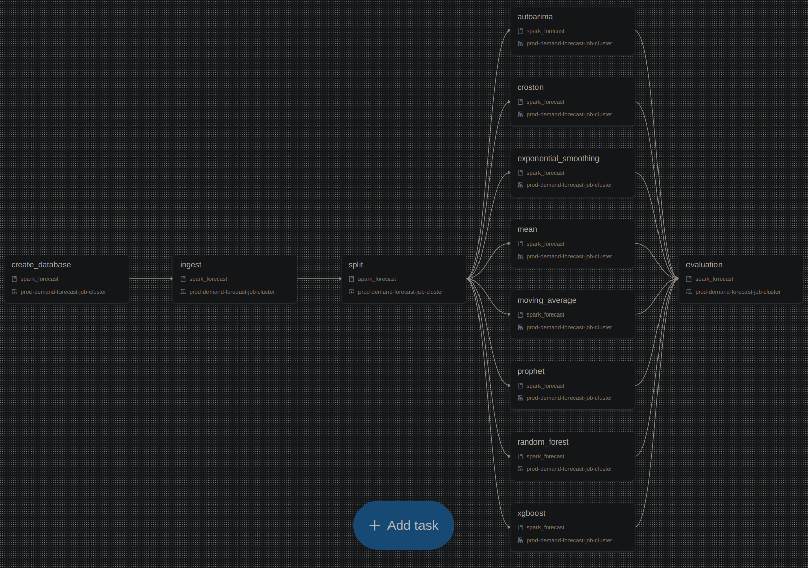

# spark-forecast

Spark Forecast is a personal project to explore distributed forecasting on Spark using [darts](https://github.com/unit8co/darts). The project uses Databricks Asset Bundles (dap) to deploy an example of demand forecasting pipeline as Databricks Workflow.

While using this project, you need Python 3.10 and `poetry` for package management.

## Local environment setup

1. Install poetry, a python packaging and dependency management.
```
curl -sSL https://install.python-poetry.org | python -
```

2. If you don't have JDK installed on your local machine, install it:
```
apt install openjdk-17-jdk
```

3. Install project locally (this will also install dev and test requirements):
```
poetry install --with dev,test
```

4. Alternatively, create a docker image with all dependecies:
```
docker build -t spark-forecast .
```

The commands in the following sections can be run with `poetry run <command>` or exactly as they are from inside a virtual environment activated with `poetry shell`.

## Running unit tests

For unit testing, please use `pytest`:
```
pytest tests/unit --cov
```

Alternatively, using docker
```
docker run --rm spark-forecast poetry run pytest tests/unit --cov
```

Please check the directory `tests/unit` for more details on how to use unit tests.
In the `tests/unit/conftest.py` you'll also find useful testing primitives, such as local Spark instance with Delta support, local MLflow and DBUtils fixture.

## Databricks Setup

- [Create an Azure Account](https://azure.microsoft.com)
- [Create an Azure Databricks Workspace](https://learn.microsoft.com/en-us/azure/databricks/getting-started)
- [Create Azure Data Lake Storage Gen 2](https://learn.microsoft.com/en-us/azure/storage/blobs/create-data-lake-storage-account)
- [Create Unity Catalog Metastore](https://learn.microsoft.com/en-us/azure/databricks/data-governance/unity-catalog/get-started)
- [Enable a workspace for Unity Catalog](https://learn.microsoft.com/en-us/azure/databricks/data-governance/unity-catalog/enable-workspaces)
- [Create a catalog with name `demand-forecast`](https://learn.microsoft.com/en-us/azure/databricks/data-governance/unity-catalog/create-catalogs)
- [Create Personal Access Token](https://learn.microsoft.com/en-us/azure/databricks/dev-tools/auth#--azure-databricks-personal-access-tokens-for-workspace-users)

## Running on Databricks

### Setting

Install the Databricks CLI from https://docs.databricks.com/dev-tools/cli/databricks-cli.html

Authenticate to your Databricks workspace:
```
databricks configure
```

### Deploy on a Job Compute

Deploy demand-forecast from dev target.
```
databricks bundle deploy --target dev
```

(Note that "dev" is the default target, so the `--target` parameter
is optional here. If the workflow is not specified all are deployed)

You can find that job by opening your workpace and clicking on **Workflows**. Target with development mode are deployed with the prefix `[<target> ${workspace.current_user.userName}]` to avoid user collision.

Similarly, to deploy a production copy, type:
```
databricks bundle deploy --target prod
```

To run a job or pipeline, use the "run" comand:
```
databricks bundle run --target dev demand-forecast
```

### Deploy on an interactive cluster

The workflows from a target with `mode: development` as the `dev` on this project can override the compute used in the deployment. To do this the following steps must be follows:

1. Create a cluster with the environment variables `MLFLOW_EXPERIMENT_NAME` and `WORKSPACE_FILE_PATH` as are set in the `databricks.yml` file. Navigate to the "Advanced options" section of your cluster setting, there you can set them in the "Environment variables" section.

2. Install the project python wheel in the cluster. To install a previously deployed wheel, navigate to the "Install library" section of your cluster settings, where you can explore the Workspace to locate and select the wheel's path, or you can upload a local generated wheel running the command `poetry build`, it will be created on the `dist/` directory.

3. Deploy the workflow to the cluster with the given compute ID.
```
databricks bundle deploy --compute-id <compute-id> -t dev demand-forecast
```

4. Similarly to other workflow, use the "run" command:
```
databricks bundle run -t dev demand-forecast
```

### Working with notebooks and Repos

To start working with your notebooks from a Repos, do the following steps:

1. Add your git provider token to your user settings in Databricks

2. Add your repository to Repos. This could be done via UI, or via CLI command below:
```
databricks repos create --url <your repo URL> --provider <your-provider>
```
This command will create your personal repository under `/Repos/<username>/spark-forecast`.

3. Synchronize your local repository with a Databricks repo. With this any change on your local repository will be reflected in the Databricks repo.
```
databricks sync --profile <local-path> <remote-path> --watch
```

4. In `notebooks/sample_notebook.py` there is an example of how to launch the `split` task on a cluster. Note that the cluster must have all dependencies explained in the previous section.

## Arquitecture


### Forecast pipeline

The forecast workflow `<env>-demand-forecast` reads and writes to the `demand-forecast` catalog from a Unity Catalog metastore. The production workflow is scheduled to run every Monday at 23:59 on America/Santiago time. It downloads the sales from a public repository, this information is written to a delta table. All outputs are written to the `demand-forecast` catalog, depending of the development environment it uses the `dev`, `staging` or `prod` database.

### CI/CD pipeline

Continuos Integration (CI) and Continuos Deployment (CD) pipeline is orquestrated by Github Actions. In the first place, when a standard pull request is sent to the main branch the following steps are executed: checkout the repository, authenticate to Azure and retrieve Databricks secrets from an Azure Key Vault, set up `python`, install the package manager `poetry`, install dependencies, run unit tests, deploy and launch the `staging-demand-forecast` workflow to a Databricks workspace. In the second place, when a tag is pushed to the repository, the same steps as the previous pipeline are executed, with the exception that the `prod-demand-forecast` workflow is deployed and is not launched, because the production workflow is scheduled.

## Forecast workflow

Workflows definition are in the `databricks.yml` file. It has the `<target>-demand-forecast` workflow, where `<target>` is the target or environment, with values in `[dev, staging, prod]`. The main difference between them is where they read and write. Additionally, the production target is the only one that is orchestrated. The following is the DAG (Directed Acyclic Graph) representation of the workflow.



### Parameters

Each task in the workflow has its own parameter file in `conf/tasks/<task-name>_config.yml`. This parameter is used in the `python_wheel_task` section in the `databricks.yml` file, as value in `--conf-file /Workspace${workspace.root_path}/files/<relative_path>` parameter.

Common parameters to all tasks.

- `env`: Dictionary with the environments. There are three environment, `dev`, `staging` and `prod`. This values are used in the `"--env <env>"` parameter, located in the `python_wheel_task` section in the `databricks.yml` file. The `Task` abstract class uses this paremeter to extract environment specific parameters from the file.
- `execution_date`: String, execution date in format `"<yyyy>-<mm>-<dd>"`. If specified is recommended to set a Monday; otherwise, the last Monday from the current date will be used. Additionally, is used as date boundary, where `date <= execution_date - 1`.
- `input|output`: Dictionary, every task has to read some input and write some output. If there are multiple inputs or outputs, this parameter is a two-level dictionary, where the keys are the names of the tables; otherwise, it is a one-level dictionary where table names are omitted. Depending on the source format, it could have the following keys: The `path` and `sep` when the source is a CSV, used to locate the file and to indicate column separator character; the `database` and `table` name where it will be written as delta table.

Task specific parameters.

- `time_delta`: Integer, used to filter the data by a time window, with date betwen `[start_date, end_date]`, where `end_date = execution_date - 1` and `start_date = execution_date - time_delta`.
- `group_columns`: List of string, used to identify a serie as unique.
- `time_column`: String, time column to use as serie time index.
- `target_column`: String, target column to use as serie value.
- `metrics`: List of string, list of metrics to compute. By the moment, those names should match the name of a function in the `darts.metrics` module.
- `model_selection_metric`: String, metric from `metrics` used to select the best model per serie, the critera is the one with minimum value.
- `test_size`: Integer, number of past days since `execution_date - 1` that are used as part of the test set.
- `model_name`: String, must be the name of a model class present in `MODELS` (`darts.models` module), a reference to this can be found in the file `spark_forecast/model.py`. This is used as the `--model-name <model-name>` argument in the `python_wheel_task` related to forecasting.
- `model_params`: Dictionary, optional per forecast model, key-value pairs used to instantiate a forecasting model.
- `steps`: Integer, number of days since the `execution_date` to forecast.
- `freq`: String, represents the frequency of the pandas DatetimeIndex, where the value `1D` means daily frequency.

## Tasks

In this section we explain what does each task of the workflow.

### create_database

Create a database in the catalog `demand-forecast` with the name of the `database` parameter if it does not exist.

### ingest

Overwrite the `input` table with the data that comes the CSV file `data/train.csv`. If the parameter `stores` is set it load only these stores. The dataset comes from kaggle (https://www.kaggle.com/competitions/demand-forecasting-kernels-only/data?select=train.csv)

### split

Overwrite the `split` table. This table comes from the `input` and has the same level of granularity. The main functionality of this task is to split the dataset in training and testing sets, and guarante continuity of each time serie, where null values are filled by zero. Each serie is characterized by the `group_columns` parameter with value `["store", "item"]`, columns used to identify a serie as unique; the `time_column` parameter to identifies the column to use as time index, with value `"date"`; and the `target_column` parameter to identifies the column to use as values of the serie, with value `"sales"`. The `test_size` parameter is used to define the rows that are part of the test set, the sales of the last `test_size` days are part of this set, the value used is 14 days.

### models

All model tasks, for instance, `exponential_smoothing`, overwrite the partition `model=<model-name>` in the tables `forecast_on_test` and `all_models_forecast`. It uses `split` table as input. The parameters `group_columns`, `time_column` and `target_column` are used to characterize a time serie with the same values as the`split` task. The `model_params` parameter has model specific hyperparameters as key-value pairs. The `test_size` parameter is used to know how many periods to forecast after training on the training set, this forecast is stored in the `forecast_on_test` table. Similarly, the `steps` parameter is used to know how many periods to forecast after training on the full dataset, this forecast is stored in the `all_models_forecast` table.

### evaluation

Overwrite the tables `metrics`, `best_models` and `forecast`. As input it uses tables `split`, `forecast_on_test` and `all_models_forecast`. The parameters `group_columns`, `time_column` and `target_column` are used to characterize a time serie with the same values as the `split` and `model` tasks. The `metrics` parameter has a list of metrics to compute from the input tables `split` (where split column is equal to test) and `forecast_on_test`, the result is written to the `metrics` table, where the metrics computed are `["mape", "rmse", "mae"]` and them must be in `darts.metrics` module . The `model_selection_metric` parameter is used to filter the table `metric` and choose the best model per store-item, the critera is the one with minimum value, this result is written in the `best_models` table. Finnally, the `forecast` table is written, it is produced by the inner join between `all_models_forecast` and `best_models`, with the goal of having only the forecast of the best model per store-item.

## Data lineage

Data lineage graph extracted from the Unity Catalog, specifically the `demand-forecast` catalog and the `prod` database.


## Development methodology

This section detailed the development methodology proposed and used.


### Development environment

The development environment is means to be used by developers to test their early stage developments, such as their feature branch which are in progress. To test their new feature, they can develop it in their favourite IDE. Create some unit test again to run their code. Then deploy the `dev-demand-forecast` on the Databricks workspace, following some of the three development loops mentioned in the [Setting chapter](#setting). When they are done, they can commit their code using the `pre-commit` check and following the [conventional commits](https://www.conventionalcommits.org/en/v1.0.0/) standard. Is recommended to apply `git rebase` or `git push -f feat/<feat-name>` in order to keep a clean branch before merging with the `main` branch.

### Staging environment

This environment is used to keep a clean main branch with code tested by unit and integration tests. When a pull request is created, where the target branch is the `main` branch a CI pipeline is triggered. The pull request will trigger the pipeline detailed in the `.github/workflows/onpush.yml` file. These steps are: checkout the branch from the repository, authenticate to Azure and retrieve Databricks secrets from an Azure Key Vault, install `python`,  install `poetry`, install dependencies using `poetry`, run `pre-commit` checks, run unit tests, and deploy and launch the `staging-demand-forecast` workflow in the Databrick workspace. Finnally, if all steps were successful and the reviewers approved the pull request, then the merged to the `main` brach is performed.

As a good practice is recommended to do a `pull --rebase origin main` before to send a pull request, this would update the feature branch with respect to the `main` branch. In this way, the CI pipeline will test a merged version instead of a pre-merged version, even if the later is successfull, the post-merged version might not be. Another reason to do this is to keep a linear history, which makes it easier for reviewers to focus only on new changes. A good article about the use of rebase can be found [here](https://www.atlassian.com/git/tutorials/merging-vs-rebasing#:~:text=Merging%20is%20a%20safe%20option,onto%20the%20tip%20of%20main%20.).

### Production environment

To cut a release the following steps must be followed. Upgrade package version in the `pyproject.toml` file, add a git tag with the same `<version-number>`, then push the commit to the main branch along with the tag. This will trigger the pipeline detailed in the `.github/workflows/onrelease.yml` file. These steps are: checkout the branch from the repository, authenticate to Azure and retrieve Databricks secrets from an Azure Key Vault, install `python`,  install `poetry`, install dependencies using `poetry`, run `pre-commit` checks, run unit tests, deploy the `prod-demand-forecast` workflow on the Databrick workspace, and publish the release. Note that this pipeline does not launch the workflow, because the production workflow is scheduled to run weekly.
